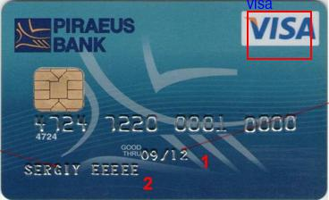
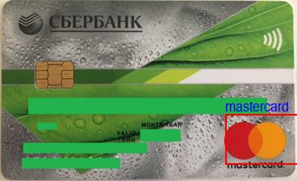

# Tiny CNN for Visa / MasterCard classification and logo localization

- size: 483 kb (fp16)
- dataset: https://drive.google.com/file/d/1iUReVs8L7FrtwpKG4QeluwlX8Ri1cJXh/view?usp=sharing (just run `run.sh` to download it)
- [card with logo synth data generator](card_generator/card_generator.ipynb) (to prevent logo position overfitting)

